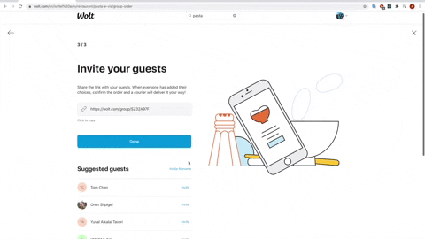

# Readme

# What is this project about

My team uses Wolt everyday for our lunch order.  
We use Wolt's shared order and split the payment on Cibus.  
After few weeks of this practice, I thought it might be cool if I could invite all of my team at once   
rather than the "one by one" option currently available on Wolt.  
Then I've noticed a bigger pain for my team which is the manual payment split,  
so I decided to create this Chrome extension to solve these everyday hassles.

# Features

## Invite all group members



## Split shared order payment


# Installation Guide

1. Browse to the extension page on [Google Web Store](https://chrome.google.com/webstore/detail/pimp-my-wolt/edfemdoibbcbmkojfdeldnllcbnpmfld) and click `Add to Chrome`.
2. Set your group name on the extension's options.  
In order to enter to the options page, browse to:  
chrome://extensions/?options=edfemdoibbcbmkojfdeldnllcbnpmfld  
For more details about groups, [please see here](#What-is-Group-and-What-is-it-used-for).
3. [Make sure](#List-group-members) your group is properly configured. 

# What is Group and What is it used for

Group is a set of people you typically share Wolt's orders with.  
Each group member represented by an object containing its Wolt name and Cibus name.  
Formally:

```tsx
type Group = GroupMember[]

interface GroupMember {
	woltName: String;
	cibusName: String;
}
```

This mapping between Wolt name and Cibus name allows the extension to remember who ordered what on Wolt, and then "charge" the right amount the right person on Cibus.  

# Manage Group Members

Group members are managed via a crud service.  
In the following demonstration I'll use bash to interact with this service,  
but you may chose your favourite alternative. 

## Add new group member

```bash
curl -X POST \
  https://amitmarx.wixsite.com/pimp-my-wolt/_functions/group_member/{GROUP_NAME} \
  -H 'content-type: application/json' \
  -d '{
        "cibusName": "{CIBUS_NAME}",
        "woltName": "{WOLT_NAME}"
}'
```

- GROUP_NAME is your team's chosen name.  
(Groups are created on the fly, first group member will initiate the group).
- WOLT_NAME is your display name on Wolt.  
It may be found here: [https://wolt.com/en/me](https://wolt.com/en/me).
- CIBUS_NAME is your display name on Cibus.  
It may be found here: [https://www.mysodexo.co.il/new_my/new_my_details.aspx](https://www.mysodexo.co.il/new_my/new_my_details.aspx).

## Delete group member

```bash
curl -X DELETE \
  https://amitmarx.wixsite.com/pimp-my-wolt/_functions/group_member/{MEMBER_ID}
```

- MEMBER_ID may be found from the [list group members](#list-group-members) endpoint.

## List group members

```bash
curl https://amitmarx.wixsite.com/pimp-my-wolt/_functions/list_group_members/{GROUP_NAME}
```

- GROUP_NAME is your team's chosen name.